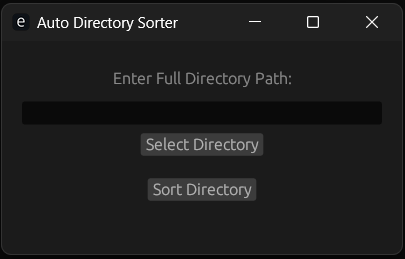

# Directory Sorter

a eframe gui app to sort any directory.
written in **rust**

## Usage

- go to releases page and download windows binary( linux and macos support in progress ).
- run the binary input your dir path and click sort directory button.

**NOTE:** a console window will open, you can see the complete log there.

**`WIP`**
